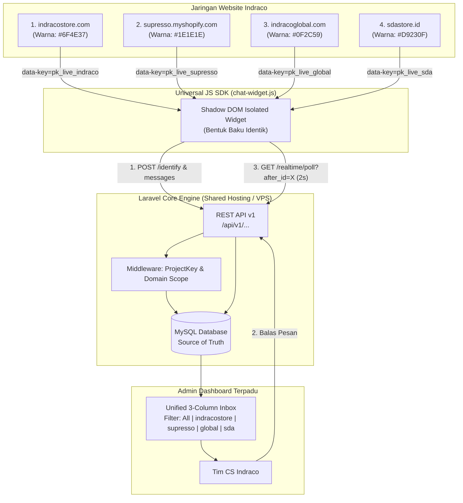
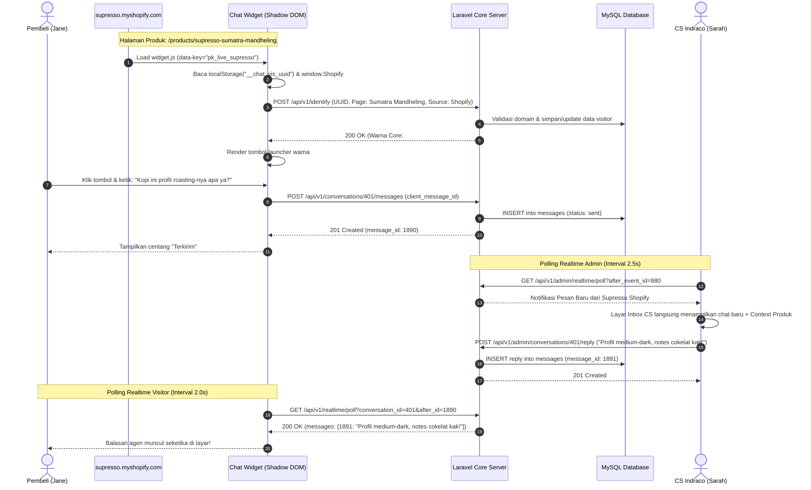

# Arsitektur & Skenario Riil: Multi-Project Indraco Group

Dokumen ini menjelaskan alur kerja (*end-to-end flow*), skenario nyata, dan implementasi teknis untuk 4 situs web di bawah satu payung tenant **Indraco Group**:
1. **indracostore** (B2C E-Commerce Retail)
2. **supresso shopify** (Toko Online Premium Shopify)
3. **indracoglobal** (Portal Corporate B2B & Export)
4. **sdastore** (Toko Distribusi Retail SDA)

---

## 1. Struktur Organisasi & Konfigurasi Multi-Project

Satu server Laravel Core melayani keempat website secara terpusat. Agen CS hanya login ke **satu Admin Dashboard terpadu**, namun pengunjung di masing-masing website melihat widget dengan **warna brand khas masing-masing** (bentuk dan tata letak widget tetap 100% baku dan identik).

```text
                               Tenant: Indraco Group
                                        │
     ┌──────────────────┬───────────────┴───────────────┬──────────────────┐
     ▼                  ▼                               ▼                  ▼
Project 1:         Project 2:                      Project 3:         Project 4:
indracostore       supresso shopify                indracoglobal      sdastore
────────────────   ──────────────────────────────  ─────────────────  ────────────────
• Domain:          • Domain:                       • Domain:          • Domain:
  indracostore.com   supresso.myshopify.com          indracoglobal.com  sdastore.id
• Public Key:      • Public Key:                   • Public Key:      • Public Key:
  pk_live_indraco    pk_live_supresso                pk_live_global     pk_live_sda
• Warna Core:      • Warna Core:                   • Warna Core:      • Warna Core:
  #6F4E37 (Coffee)   #1E1E1E (Luxury Dark Gold)      #0F2C59 (Navy B2B) #D9230F (Crimson)
• Sumber Halaman:  • Sumber Halaman:               • Sumber Halaman:  • Sumber Halaman:
  Website Retail     Shopify Liquid + Product        B2B Inquiry Form   Cabang Toko SDA
```

---

## 2. Diagram Alur Sistem (High-Level Architecture Flowchart)



---

## 3. Alur Detail Percakapan Pengunjung (Sequence Flowchart)

Berikut adalah diagram urutan ketika seorang pelanggan mengunjungi **supresso shopify** dan bertanya ke CS:



---

## 4. Skenario Nyata di 4 Website Indraco

### Skenario 1: Supresso Shopify (Toko Kopi Spesialis)
- **Pengunjung**: Jane membuka produk *Supresso Sumatra Mandheling Capsule*.
- **Tampilan Widget**:
  - Tombol launcher berwarna hitam elegan (`#1E1E1E`) dengan aksen gold.
  - Bentuk gelembung chat dan composer tetap identik dengan website lainnya.
- **Deteksi Konteks Otomatis**:
  - Tanpa perlu bertanya, panel kanan CS di Laravel Dashboard menampilkan:
    - **Source**: `shopify`
    - **Current Product**: `Supresso Sumatra Mandheling Capsule`
    - **URL**: `https://supresso.myshopify.com/products/sumatra-capsule`
    - **Currency**: `IDR`
- **Hasil**: CS langsung menjawab spesifikasi kompatibilitas mesin Nespresso tanpa membuang waktu meminta link produk.

---

### Skenario 2: Indraco Global (Corporate B2B & Ekspor)
- **Pengunjung**: Mr. Tan (Buyer dari Singapura) membuka halaman *Export / Private Label*.
- **Tampilan Widget**:
  - Tombol launcher berwarna biru navy korporat (`#0F2C59`).
  - Greeting otomatis: *"Welcome to Indraco Global. How can we assist your business inquiries?"*
- **Aksi Pengunjung**:
  - Mr. Tan memasukkan email `tan@singapore-cafe.sg` dan menanyakan Minimum Order Quantity (MOQ) ekspor green beans.
- **Hasil di Inbox CS**:
  - CS melihat badge proyek `[indracoglobal]`.
  - Profil kontak langsung terhubung (*contact identified*) dengan email `tan@singapore-cafe.sg`.
  - CS dapat langsung meng-assign percakapan ke tim divisi B2B Export dengan 1 klik dropdown.

---

### Skenario 3: Indraco Store (Retail B2C E-Commerce)
- **Pengunjung**: Budi mencari promo kopi sachet untuk konsumsi harian keluarga.
- **Tampilan Widget**:
  - Tombol launcher berwarna cokelat kopi hangat (`#6F4E37`).
  - Greeting: *"Halo! Ada promo bundling kopi spesial hari ini lho, ada yang bisa dibantu?"*
- **Aksi Pengunjung**:
  - Mengunggah screenshot bukti voucher tidak bisa dipakai via tombol klip kertas (`📎`).
- **Hasil di Inbox CS**:
  - File langsung divalidasi aman di server Laravel dan muncul sebagai preview gambar di thread percakapan.
  - CS membalas memberikan kode voucher baru pengganti.

---

### Skenario 4: SDA Store (Retail Cabang & Distribusi)
- **Pengunjung**: Rina mengecek jam operasional dan ketersediaan stok fisik di cabang SDA.
- **Tampilan Widget**:
  - Tombol launcher berwarna merah retail (`#D9230F`).
  - Status online agen menunjukkan jam operasional cabang lokal.
- **Hasil di Inbox CS**:
  - Muncul di folder filter `[sdastore]`. Agen SDA cabang langsung membalas konfirmasi stok toko terdekat.

---

## 5. Tampilan CS di Admin Dashboard Terpadu (Single Unified Inbox)

Tim Customer Service Indraco tidak perlu membuka 4 tab browser berbeda. Seluruh percakapan masuk ke dalam satu tampilan inbox 3-kolom yang rapi:

```text
┌──────────────────────────────────────┬────────────────────────────────────┬────────────────────────────────────┐
│ Panel 1: Daftar Percakapan           │ Panel 2: Percakapan Aktif          │ Panel 3: Konteks Pengunjung        │
├──────────────────────────────────────┼────────────────────────────────────┼────────────────────────────────────┤
│ [Filter Proyek: Semua Proyek ▼]      │ Header: Jane Doe                   │ PROFIL PELANGGAN                   │
│ [All | Open (4) | Closed | Mine]     │ Asal: [supresso shopify]           │ Nama: Jane Doe                     │
│                                      │ Status: Open • Agen: Sarah         │ Email: jane@gmail.com              │
│ • [supresso] Jane Doe                ├────────────────────────────────────┤ Device: iPhone 15 (Safari)         │
│   "Kopi ini profil roasting-nya apa?"│ Jane (14:32):                      │ IP: 180.252.16.89 (Surabaya)       │
│   2m lalu • Unread: 1 [BARU]         │ "Kopi ini profil roasting-nya apa?"│                                    │
│                                      │                                    │ KONTEKS HALAMAN AKTIF              │
│ • [indracoglobal] Mr. Tan            │ Sarah - CS (14:33):                │ Proyek: supresso shopify           │
│   "Inquiring about 20ft container MOQ│ "Profil medium-dark, notes cokelat │ Halaman: /products/sumatra-capsule │
│   12m lalu • Agen: Budi              │ kak! Cocok untuk manual brew."     │ Produk: Sumatra Mandheling Capsule │
│                                      ├────────────────────────────────────┤ Mata Uang: IDR                     │
│ • [indracostore] Budi Santoso        │ [Composer: Tulis balasan...]       │                                    │
│   "Screenshot voucher diskon"        │ [📎] [                      ] [▲] │ WIDGET BRAND COLOR                 │
│   24m lalu • Closed                  │                                    │ Core Color: #1E1E1E (Dark Gold)    │
└──────────────────────────────────────┴────────────────────────────────────┴────────────────────────────────────┘
```

---

## 6. Contoh Implementasi Script Tag di Masing-Masing Web

Pemilik web hanya perlu menempelkan satu baris script sebelum `</body>`:

### Di `indracostore.com` (HTML / Laravel):
```html
<script
  src="https://chat.indraco.com/widget.js"
  data-key="pk_live_indraco"
  async>
</script>
```

### Di `supresso.myshopify.com` (`theme.liquid`):
```liquid
<script
  src="https://chat.indraco.com/widget.js"
  data-key="pk_live_supresso"
  async>
</script>
```

### Di `indracoglobal.com` (WordPress / Web CMS):
```html
<script
  src="https://chat.indraco.com/widget.js"
  data-key="pk_live_global"
  async>
</script>
```

### Di `sdastore.id` (HTML / React):
```html
<script
  src="https://chat.indraco.com/widget.js"
  data-key="pk_live_sda"
  async>
</script>
```

---

## 7. Keunggulan Arsitektur untuk Indraco Group

1. **Efisiensi Biaya Operasional**: Cukup 1 server backend Laravel + 1 database MySQL di hosting Indraco. Tidak perlu membayar biaya langganan bulanan per-domain seperti di Zendesk/Intercom.
2. **Konsistensi Identitas Brand**: Tiap unit bisnis mempertahankan estetika warnanya (kopi, mewah, korporat, retail), namun pelanggan mendapatkan pengalaman chat yang sama-sama cepat dan responsif.
3. **Sentralisasi Tim CS**: Manajer CS dapat memonitor performa agen dan waktu respons (*response time*) di seluruh lini bisnis dalam satu laporan analitik terpadu.
